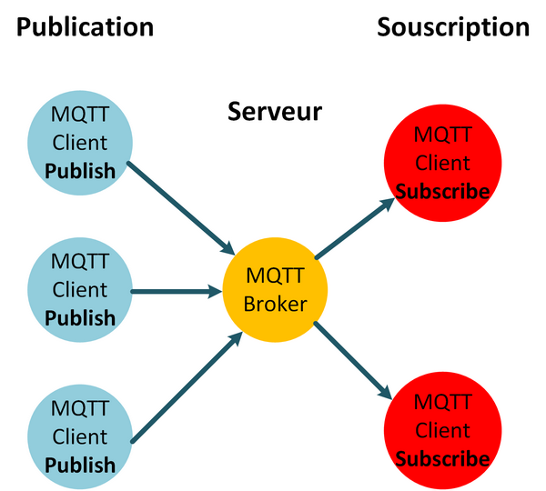
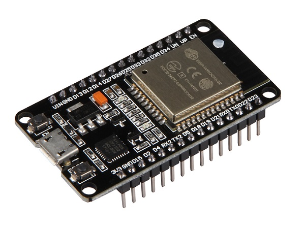
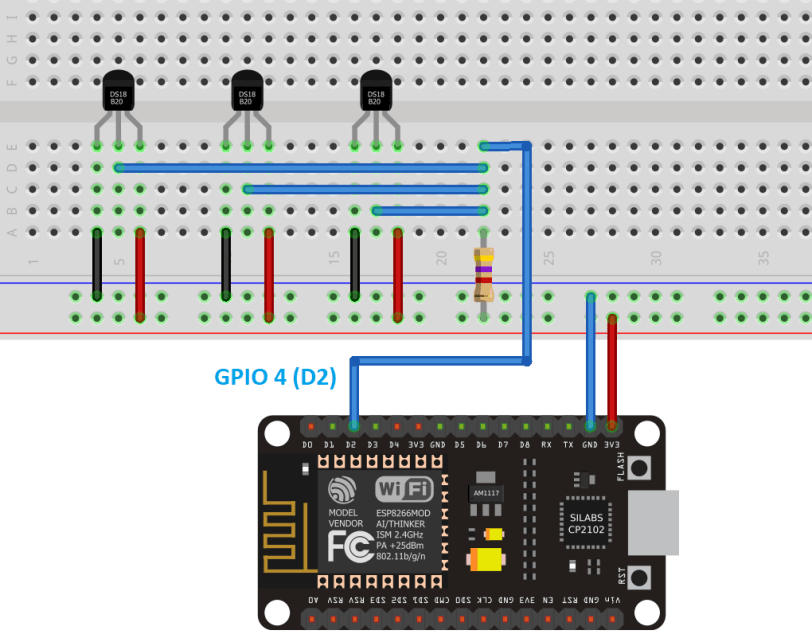
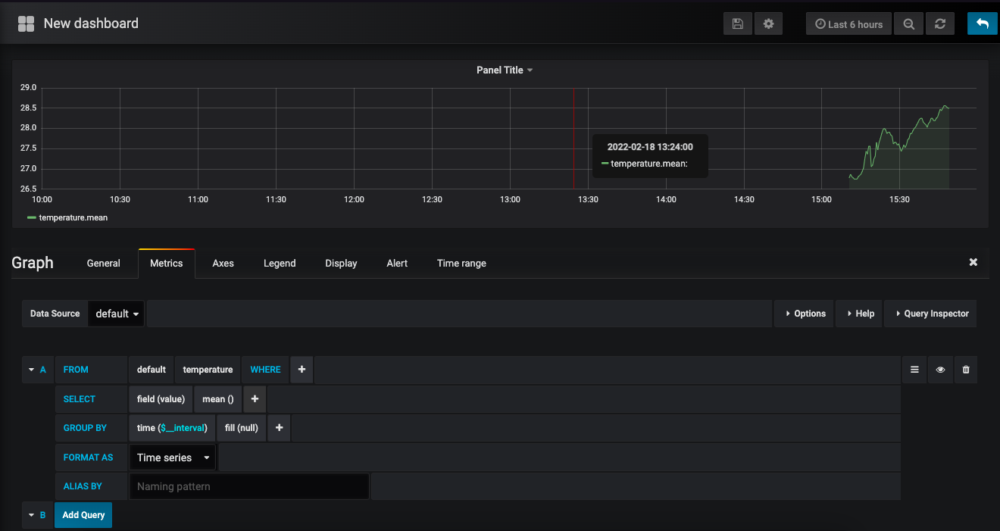

##  MQTT Température et Humidité

Accès et suivi de temperature à distance en utilisant MQTT (Cloud Broker), InfluxDB, et Grafana

#### Auteurs

```
Madjid TAOUALIT : tm177375
Yugurten MERZOUK : my175117

```


#### Téléchargement

Cloner (ou télécharger et unzipper) le répertoire (Assurer que vous avez l'accès)

```
$ git clone https://www-apps.univ-lehavre.fr/forge/tm177375/mqtt-temperature-and-humidity-remote-tracker.git
$ cd iot-monitoring-mqtt/
$ chmod +x run.sh
```

#### Bibliothèques

S'assurer que ces bibliothèques sont bien installées:

Bibliothèques Arduino:

* [Adafruit Unified Sensor](https://github.com/adafruit/Adafruit_Sensor)
* [DHT sensor](https://github.com/adafruit/DHT-sensor-library)
* [Adafruit BME280](https://github.com/adafruit/Adafruit_BME280_Library)
* [Arduino Client pour MQTT](https://github.com/knolleary/pubsubclient)
* [DallasTemerature](https://github.com/milesburton/Arduino-Temperature-Control-Library)

Installation des bibliothèques:

* Aller vers : Sketch -> Include Library -> Manage Libraries...
* Chercher les bibliothèques puis les installer (De préférence la dernière version)

#### Utilisation des bibliothèques
Charger les fichiers suivants
```
#include <WiFi.h>
#include <PubSubClient.h>
#include <DHT.h>
#include <OneWire.h>
#include <DallasTemperature.h>
```

#### Installation de Node.js

1  Installation de Node.js sur Windows

* Aller vers le site [https://nodejs.org/en/download/](https://nodejs.org/en/download/) et télecharger les bibliothèques nécessaires.
* Suivre les instructions.

2  Installation de Node.js sur macOS

```
$ /usr/bin/ruby -e "$(curl -fsSL https://raw.githubusercontent.com/Homebrew/install/master/install)"
$ brew -v
$ brew install node
$ node -v
$ npm -v
```

* [Comment installer NodeJS et NPM sur Mac en utilisant Homebrew](https://www.dyclassroom.com/howto-mac/how-to-install-nodejs-and-npm-on-mac-using-homebrew)

#### NPM

```
$ cd mqtt-bridge/
$ npm install
```

#### Démarrer MQTT Bridge

```
$ ./run.sh
$ docker ps -a
$ docker container logs -f mqtt-bridge
```

#### Grafana

Ouvrir le naviguateur et aller vers [http://localhost:3000](http://localhost:3000)

* Username: admin
* Password: admin

#### Captures d'écran








